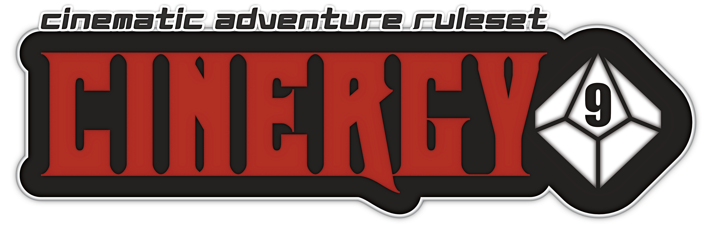

# Cinergy9

### A Cinematic Adventure Ruleset for Tabletop Roleplaying Games (RPGs)

***Under Construction.*** The *Cinergy9 Cinematic Adventure Ruleset* attempts to bring a standardized set of rules to the tabletop, which utilizes a cinematic gameplay style. The rules herein are lite and minimalistic, designed for storytelling and quick actions, yet allow for remarkable detail with many character options. By its very nature, this system is a non-tactical *theatre of the mind* game, meaning it runs a bit looser and faster, and although maps and miniatures can be utilized, most game aids are basic and kept to a minimum.

***Will there be an SRD?*** Yes. The *Cinergy9 Systems Reference Document* (C9SRD) contains guidelines for publishing content under a *yet-to-be-determined* game license. Stay Tuned.

Visit the official [Cinergy9](https://cinergy9.games) website, hosted at Old Man Umby's Games & Theory, for more information.
